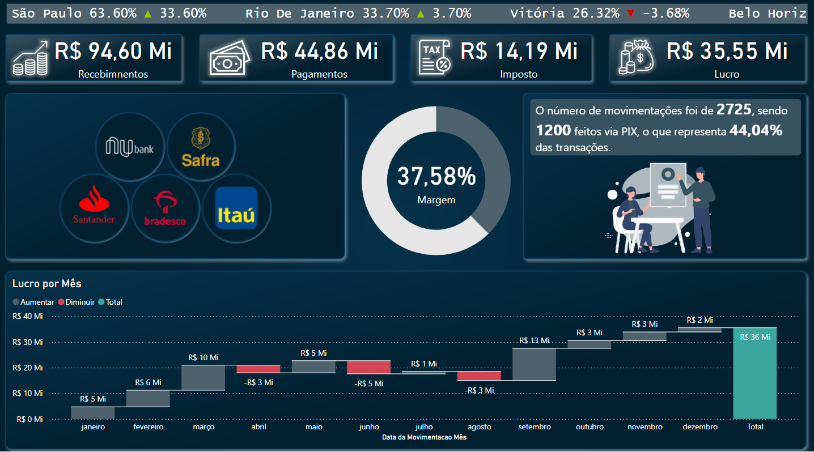
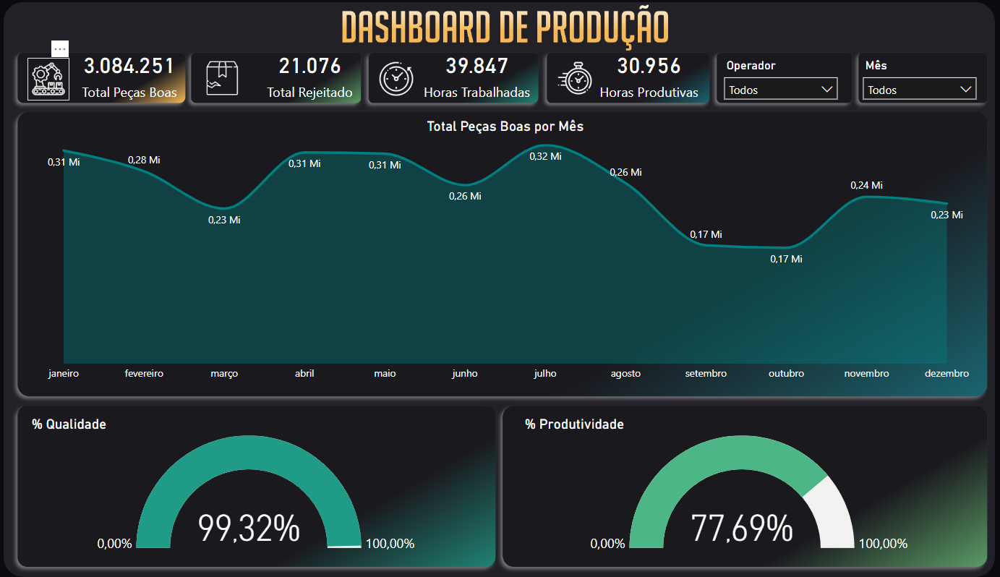
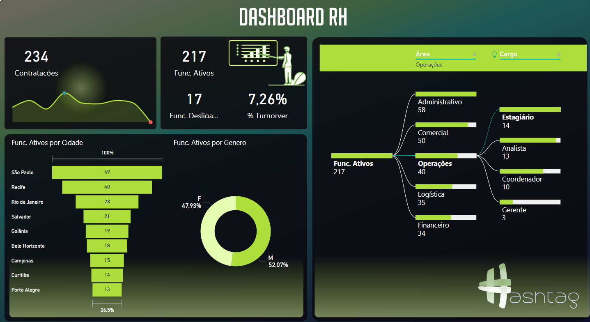
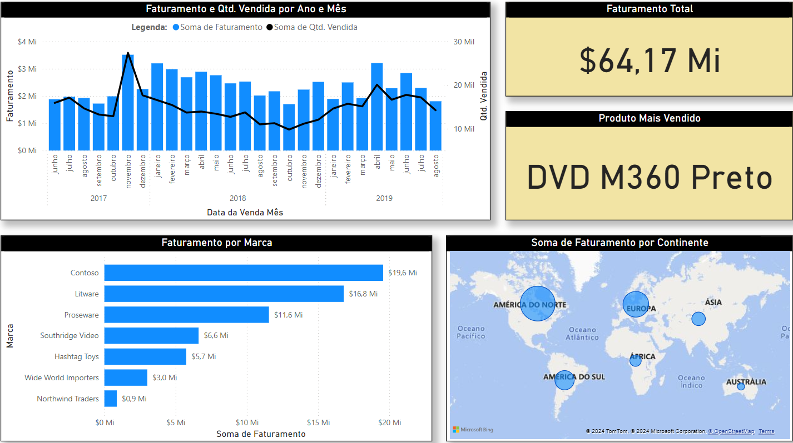

# Dashboard Suite

#### Este repositório contém uma suíte de dashboards desenvolvidos para atender diferentes áreas de uma organização, oferecendo visualizações e insights estratégicos para a tomada de decisões.

## Projetos

1. **Dashboard Financeiro**
   - Análise detalhada de receitas, despesas e indicadores financeiros.
   - Monitoramento de KPIs financeiros para suporte à gestão estratégica.
   - 

2. **Dashboard de Produção**
   - Visualização do fluxo de produção, eficiência e controle de qualidade.
   - Acompanhamento de desempenho por setor e identificação de gargalos.
   - 

3. **Dashboard de RH**
   - Gerenciamento de indicadores de recursos humanos como turnover, absenteísmo e headcount.
   - Insights sobre treinamento, desenvolvimento e bem-estar dos colaboradores.
   - 

4. **Dashboard de Vendas**
   - Análise de performance de vendas, tendências e comportamento do cliente.
   - Monitoramento de metas e métricas de desempenho por produto e região.
   - 

## Como Executar

1. Tenha o programa Power Bi instalado, seja mobile ou desktop.
2. Clone este repositório:

    ```bash
    git clone https://github.com/seu-usuario/ProjetosPowerBi.git
    ```

3. Entre na pasta do Dashboard que queira utilizar e execute o arquivo `.pbix`.

## Contribuição

Contribuições são bem-vindas! Sinta-se à vontade para abrir issues ou enviar pull requests.

## Licença

Este projeto está licenciado sob a [MIT License](LICENSE).
